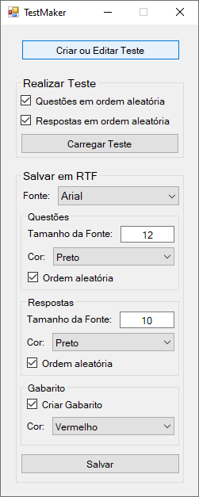
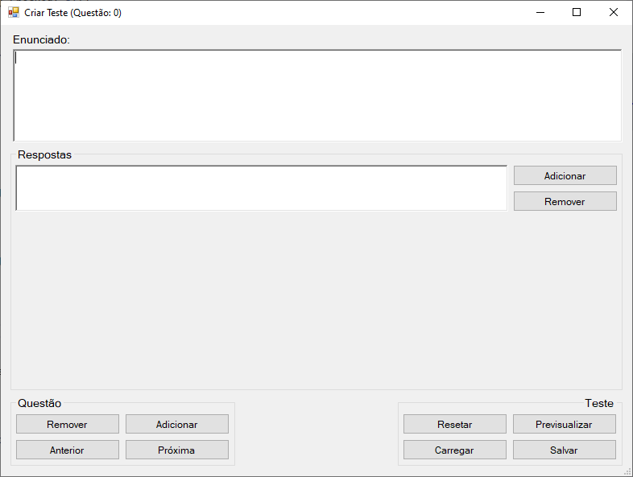
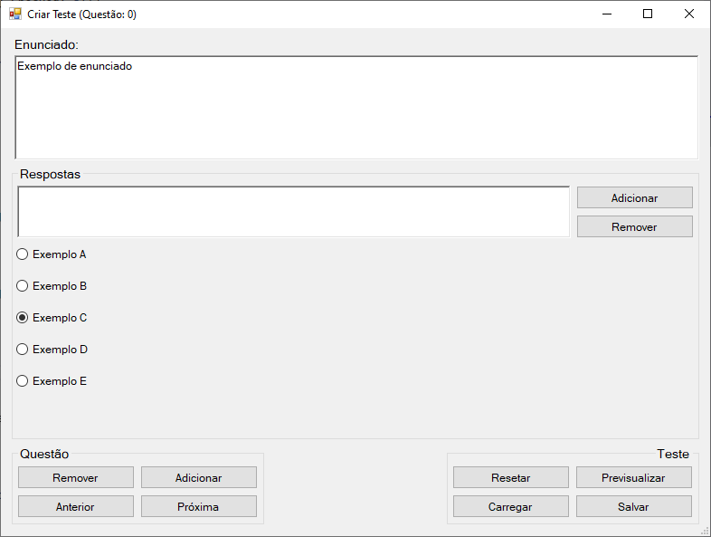
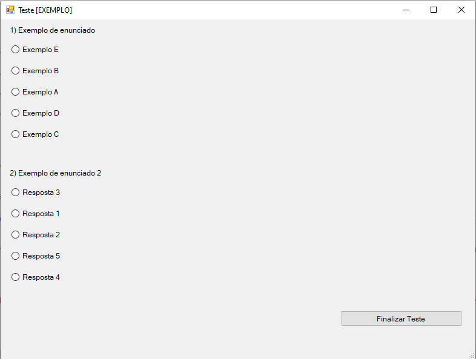

# TestMaker

Projeto desenvolvido no Visual Studio utilizando a linguagem C#.

Aplicação para criar, salvar e carregar testes multipla escolha.
 
 

 
 
* Downloads: https://github.com/iagocolodetti/TestMaker/releases
   * [TestMaker.exe](https://github.com/iagocolodetti/TestMaker/releases/download/v1.0/TestMaker.exe "TestMaker.exe")
   * [Código-Fonte](https://github.com/iagocolodetti/TestMaker/archive/v1.0.zip "v1.0.zip")